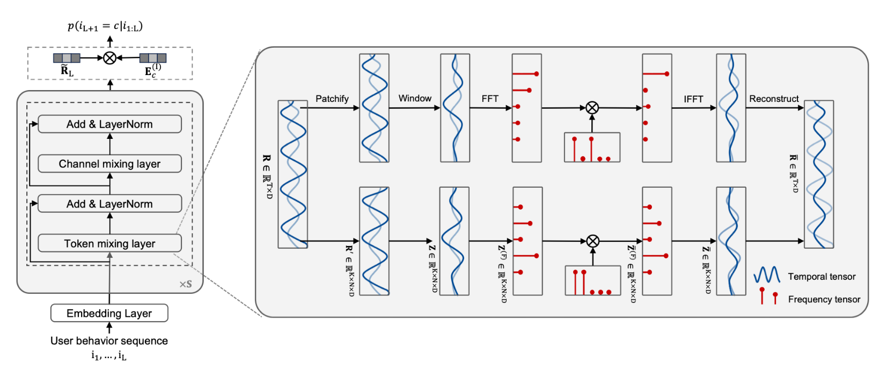

# PASER
The source code for our submission **"PASER: Patchified Spectral Representation Learning for Non-Stationary and Non-Periodic User Behavior Sequence"**.

## Requirements
* Install Python(>=3.7), Pytorch(>=1.8), Tensorboard, Tensorflow, Pandas, Numpy. In particular, we use Python 3.9.13, Pytorch 1.12.1+cu116, Tensorboard 2.11.2, Tensorflow 1.14.1.
* If you plan to use GPU computation, install CUDA. We use CUDA 11.6 and CUDNN 8.0

## Overview
**PASER** consists of stacked **patch-wise filtering blocks** to extract the user preference representation from user behavior logs, followed by a dot-product scaler for next behavior prediction. The patchified filtering block firstly segments an user behavior sequence into local patches to capture non-stationary dynamics, and then applies window functions to mitigate spectral leakage, and subsequently performs learnable spectral filtering to adaptively extract discriminative representations, and finally convert the representation from frequency domain back to time domain.

## Datasets

We reuse the datasets that are provided in [Google Drive](https://drive.google.com/drive/folders/1omfrWZiYwmj3eFpIpb-8O29wbt4SVGzP?usp=sharing)
 and [Baidu Netdisk](https://pan.baidu.com/s/1we2eJ_Vz9SM33PoRqPNijQ?pwd=kzq2). The downloaded dataset should be placed in the `data` folder. Optionally you can unzip the .zip files in this repository and move the obtained dataset files to the `data` folder.

## Reproduction

We provide approaches to reproduce the results in the main paper. You can directly run the training pipeline from scratch to check the results of SASRec and the proposed method at each hyperparameter configuration by running `bash exp_hparam.sh`, which reproduces Figure 4 in the paper. You can also reproduce the full-sort performance with by setting `--full_sort 1`.
